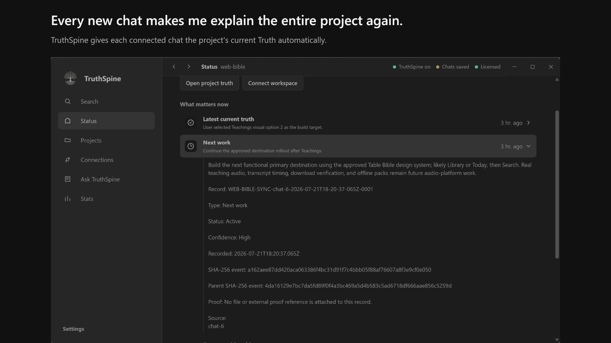

# TruthSpine

TruthSpine keeps your project's Truth current, traceable, and available to every connected agent.

Your agents get the current decisions, sources, history, and next project work without making you repeat the project, docs, files, or rules. TruthSpine maintains project Truth automatically in the background.

## Problems TruthSpine solves

- **Every new chat makes me explain the entire project again.** Connected chats receive current project knowledge automatically.
- **Teaching a new chat a large project can burn through its entire token allowance.** In the largest measured real-project test, TruthSpine reduced 1,089,135 source tokens to 5,861 context tokens, a 99.46% reduction.
- **My agents drift onto old plans or the wrong project.** Each connected chat is bound to its exact project and receives current decisions and next work.
- **My agent confidently presents lies as Truth.** TruthSpine keeps uncertain and conflicting claims visible instead of silently accepting them.
- **Important decisions disappear into old chats.** Decisions, changes, sources, and next work stay traceable through SHA-256 parent-child lineage.

## Start with your project

Try TruthSpine free for 14 days.

1. [Download TruthSpine](https://timeprooflabs.com/#download).
2. Connect a local folder, repository, or supported source.
3. Open the AI chat, IDE, or agent workspace you normally use.
4. Let TruthSpine guide the connection.

TruthSpine runs locally on your computer and keeps project content local by default.

## Built to work where You work

TruthSpine supports Codex, VS Code, GitHub Copilot, Claude Desktop, Claude Code, Cursor, Google Antigravity, Windsurf, Open WebUI, LM Studio, Continue, Cline, Roo Code, Kiro, Zed, Hermes Agent, OpenClaw, OpenCode, GitHub Copilot CLI, Droid, Pi, and OpenClaw Desktop.

## Support and feedback

- [Report a problem](https://github.com/TimeProofLabs/truthspine-app/issues/new/choose)
- [Ask a question or share an idea](https://github.com/TimeProofLabs/truthspine-app/discussions)
- [Security and privacy](https://timeprooflabs.com/security.html)
- Email: support@timeprooflabs.com

This repository is the public product hub for downloads, release notes, support, and discussion. The TruthSpine desktop application is distributed under the license included with the app; this repository does not publish the private application source code.
