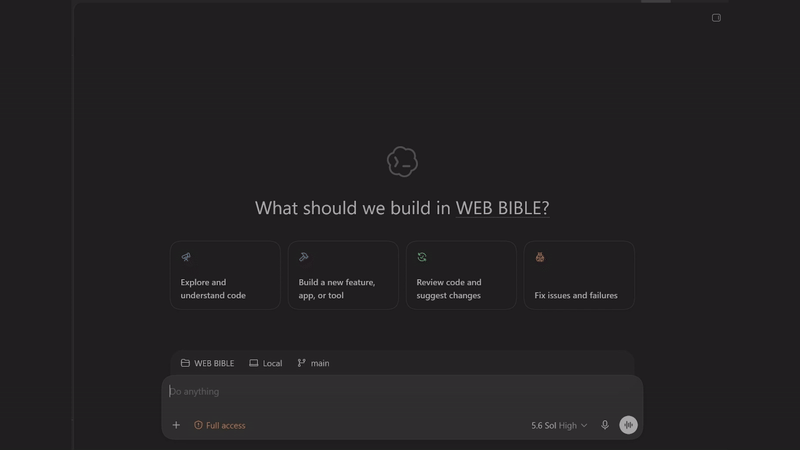

# TruthSpine


## Stop re-explaining your project to every new AI chat.

*Persistent agent memory and project context for AI coding agents, delivered over MCP — local-first.*



*Full-quality video: [media/truthspine-attach-demo.mp4](media/truthspine-attach-demo.mp4)*

## What is "project truth"?

**Project truth** is your project's living record: the latest decisions, completed work, supporting evidence, open uncertainty, and next steps — kept current, stored locally on your machine, and traceable through SHA-256 parent-child lineage so nothing is silently rewritten. TruthSpine compiles it from the sources you connect and hands it to any connected agent on demand.

## How it connects

TruthSpine is a local app with an MCP server built in — MCP is the primary way agents connect to it. You add TruthSpine the same way you'd add any MCP server: paste its config into your agent's MCP settings. The app generates the exact snippet for your machine (the JetBrains plugin has a one-click **Copy MCP Configuration** action); the macOS shape looks like this:

```json
{
  "mcpServers": {
    "truthspine": {
      "type": "stdio",
      "command": "/Applications/TruthSpine.app/Contents/MacOS/TruthSpine",
      "args": [
        "/Applications/TruthSpine.app/Contents/Resources/app.asar/src/local-app-mcp-proxy.js",
        "--host-id", "jetbrains",
        "--project-root", "/path/to/your/project"
      ],
      "env": { "ELECTRON_RUN_AS_NODE": "1", "TRUTHSPINE_PACKAGED_RUNTIME": "1" }
    }
  }
}
```

Then open a fresh chat and say **"Attach TruthSpine."** The agent pulls your current project truth — decisions, evidence, next work — and continues from there. No re-explaining.

MCP isn't the only connection method: connectors like the [TruthSpine JetBrains plugin](https://github.com/TimeProofLabs/truthspine-jetbrains) can also wire the connection for you (connect the open project, copy the MCP config, or copy the "Attach TruthSpine" phrase for chats that need a manual attach). But MCP is the main integration design — if your agent speaks MCP, this is the path.

**Where to paste it:** Claude Desktop → `claude_desktop_config.json` · Claude Code → `claude mcp add` or `.mcp.json` · Cursor → Settings → MCP · JetBrains IDEs → Settings → Tools → AI Assistant → Model Context Protocol · plus VS Code, Codex, Windsurf, Zed, and more (full list below).

## The 60-second version

1. A new chat opens with zero project context.
2. You say **"attach truthspine."**
3. TruthSpine briefs the agent: what the project is, where it stands, what the next work is.
4. The agent continues the real work — no recap from you, no digging through old chats.

That's the demo at the top of this page, unedited.

## Problems TruthSpine solves

- **New chats start from zero.** Every connected chat is bound to its exact project and receives your current decisions and next work — no recap, no archaeology through old threads.
- **Briefing a chat costs too many tokens.** TruthSpine hands the agent compact whole-project context when needed: over 90% fewer context tokens in every measured real-project test. Largest test: 1,089,135 source tokens → 5,861 context tokens, a 99.46% reduction.
- **Agents drift and work in circles.** The agent works from your recorded decisions and next steps instead of re-deriving them from docs or prompts.
- **A confident AI answer can still be wrong.** Supporting evidence and unresolved uncertainty stay visible instead of every answer being silently treated as project fact.
- **Decisions disappear into old chats.** Decisions, changes, sources, and next work stay traceable through SHA-256 parent-child lineage — locked in without you hand-building docs.

## 5-minute quickstart

1. **Install** TruthSpine from the [Microsoft Store](https://apps.microsoft.com/detail/9pbn25k75vdj) (Windows) or the [Mac App Store](https://apps.apple.com/app/id6794478470) (Mac).
2. **Connect** a local folder, repository, or supported source in the app.
3. **Paste** TruthSpine's MCP config into your agent (see *How it connects* above).
4. **Open** a brand-new chat and say **"Attach TruthSpine."**
5. **Ask** "what is this project and where are we at with it?"

Done looks like this: the agent answers from your project truth — decisions, status, next work — instead of asking you to explain. (See the demo above.)

<details>
<summary><strong>Trial & pricing details</strong></summary>

<br>

Try TruthSpine free for 14 days.

On Windows, acquire the one-time free Microsoft Store trial add-on to start 14 days. A one-time USD 95 Microsoft Store purchase unlocks TruthSpine V1 and all 1.x updates on eligible devices for that Store account; reinstalling does not restart the trial.

On Mac, the 14-day trial starts only after you choose it and Apple completes the StoreKit transaction. A one-time USD 95 non-consumable purchase unlocks TruthSpine V1 and all 1.x updates, and Restore Purchases restores access on eligible Macs.

Future major versions are separate purchases. Installing a connector does not start a TruthSpine trial or create a separate connector license.

</details>

## Works where you work

Deep support: **Claude Code · Cursor · Claude Desktop** — paste the MCP config, say "attach truthspine."

<details>
<summary>All supported platforms (23)</summary>

<br>

VS Code, GitHub Copilot in VS Code, Claude Desktop, Claude Code, Cursor, Codex, Google Antigravity, Windsurf / Devin, Open WebUI, LM Studio, Continue, Cline, Roo Code, Kiro, JetBrains IDEs, Zed, Hermes Agent, OpenClaw, OpenCode, GitHub Copilot CLI, Droid, Pi, OpenClaw Desktop.

</details>

TruthSpine runs locally on your computer and keeps project content local by default.

## About this repository

This repository is the public product hub for connectors, release notes, support, and discussion. The proprietary TruthSpine desktop application is distributed only through trusted app stores; this repository does not publish desktop packages or private application source code.

**License:** Apache-2.0 for this repository's contents (connectors, docs, and hub materials) — see [LICENSE](LICENSE). The proprietary TruthSpine desktop application itself remains closed-source and is distributed only through trusted app stores.

## Support and feedback

- [Report a problem](https://github.com/TimeProofLabs/truthspine-app/issues/new/choose)
- [Ask a question or share an idea](https://github.com/TimeProofLabs/truthspine-app/discussions)
- [Security and privacy](https://truthspine.app/security.html)
- Email: support@timeprooflabs.com

⭐ If TruthSpine saves you a re-explanation, star the repo — it helps other devs find it.
